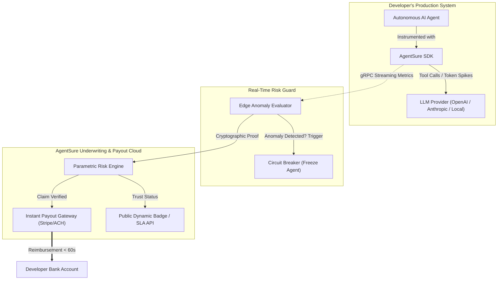

# 🛡️ AgentSure

## 🚀 Hızlı Başlangıç (Sunucusuz & Doğrudan Tarayıcıda)

Bu proje **hiçbir sunucuya ihtiyaç duymadan**, saf **HTML5, Modern CSS ve JavaScript / Node.js** ile kodlanmıştır. Python veya arka plan sunucusu yoktur.

### 1. Doğrudan Tarayıcıda Açın (Sunucusuz!)
Proje klasöründeki **`index.html`** dosyasına çift tıklamanız yeterlidir:
👉 **[index.html dosyasını doğrudan açın](file:///C:/Users/Seymen/.gemini/antigravity/scratch/agentsure/index.html)**

*(Herhangi bir tarayıcıda - Chrome, Edge, Brave, Safari - anında çalışır; terminal veya sunucu başlatmanız gerekmez!)*

### 2. Tarayıcı Üzerinde Test Edebileceğiniz Canlı Özellikler
1. **🟢 Normal Güvenli Görev (`Execute Normal Safe Task`):** Token tüketimini ve mikro telemetriyi anlık artırır, sistem yeşil nabızda kalır.
2. **⚡ Rogue Runaway Loop Simülasyonu (`Simulate Rogue Runaway Loop`):** Ajanın sonsuz döngüye girmesini simüle eder; **AgentSure Devre Kesici (Circuit Breaker)** anında devreye girip ajanı dondurur, tarayıcıda yerel **SHA-256 kriptografik kanıt** üretilir ve **0.38 saniyede parametrik tazminat** hesaba aktarılır!
3. **🔄 Sıfırlama (`Reset & Unfreeze All`):** Devre kesiciyi kaldırıp ajanları tekrar güvenli çalışma moduna alır.
4. **📋 Canlı B2B Güven Rozeti (Trust Badge):** Kendi SaaS siteniz için dinamik `Insured by AgentSure ($50k)` SVG güven rozeti oluşturur ve HTML kodunu kopyalama imkanı sunar.

### 3. İsteğe Bağlı: Node.js Terminal Testi
Terminalde çalıştırmak isterseniz:
```bash
node agent_sdk.js
```

## 2. Problem Space & Target Niche

### Hedef Kitle (Niche)
* **Otonom AI Mühendisleri & Ajan Geliştiricileri** (LangChain, CrewAI, AutoGen, LlamaIndex vb. kullananlar)
* **B2B AI Micro-SaaS Kurucuları** (Müşteri hizmetleri botları, otomatik kod yazarları, finansal analiz ajanları)
* **Kurumsal AI Operasyon Ekipleri** (Gerçek dünya API'larına yazma/işlem yetkisi veren ekipler)

### Çözülen 3 Kritik Acı Noktası (Pain Points)

```
┌─────────────────────────────────────────────────────────────────────────────┐
│ 1. Runaway Execution (Fatura Şoku)                                          │
│    Sonsuz döngüye giren veya alt-ajanları çıldıran bir sistemin bir gecede  │
│    $10,000+ API / Cloud maliyeti yaratması.                                 │
├─────────────────────────────────────────────────────────────────────────────┤
│ 2. Algorithmic Liability & Hallucination Damage (Tazminat Riski)            │
│    Dış dünyayla işlem yapan ajanın yasa dışı/hatalı taahhütte bulunması     │
│    veya yetkisiz işlem yapması (Örn: Air Canada Chatbot vakası).             │
├─────────────────────────────────────────────────────────────────────────────┤
│ 3. The Coverage Vacuum (Geleneksel Sigortaların Reddi)                      │
│    Mevcut Siber / E&O sigortaları "model halüsinasyonu" veya prompt         │
│    enjeksiyonu kaynaklı harcamaları açıkça kapsam dışı bırakır.             │
└─────────────────────────────────────────────────────────────────────────────┘
```

---

## 3. Core Differentiation (The X-Factor)

| Özellik | Geleneksel Sigorta / Redoubt | AgentSure |
| :--- | :--- | :--- |
| **Sigortalanan Varlık** | Fiziksel işletme, insan çalışanlar | Otonom Ajan kod blokları ve API akışları |
| **Risk Değerleme** | Statik formlar, mali tablolar (Yıllık) | Canlı OpenTelemetry logları & Token akışı (Milisaniyelik) |
| **Müdahale Biçimi** | Pasif (Kaza olduktan sonra dosya açma) | Aktif (Kaza anında Devre Kesici / Kill-Switch) |
| **Hasar Tazmini** | 30-90 gün evrak ve ekspertiz incelemesi | **Parametrik & 60 saniyede kriptografik kanıtla anında ödeme** |
| **Entegrasyon** | PDF poliçe ve broker telefonları | `pip install agentsure` (Tek satır kod) |

---

## 4. MVP Architecture & Core Features

Gereksiz gösterişten uzak, en yalın ama en vurucu 3 temel MVP özelliği:

### 1. Circuit Breaker SDK (Koruyucu Telemetri Katmanı)
* Python ve TypeScript için hafif sarmalayıcı (wrapper).
* LLM çağrılarını ve araç yürütmelerini (tool-calling) intercept eder.
* Harcama hızı (burn-rate/min), özyineleme derinliği (recursion depth) veya anomali eşikleri aşıldığında ajanı kontrollü şekilde dondurur.

### 2. Parametric Runaway Payout Engine (Anında Tazminat Motoru)
* Geliştirici faturayı yüklemek veya ekspertizle konuşmak zorunda kalmaz.
* Bulut/LLM sağlayıcısından gelen web hook veya telemetri imzası doğrulandığında, poliçe limiti dahilindeki aşım tutarı Stripe Connect veya banka transferi ile dakikalar içinde karşılanır.

### 3. "Insured by AgentSure" Public SLA & Trust Badge
* Geliştiricilerin web sitelerine ve API dokümanlarına ekleyebileceği dinamik güven rozeti.
* B2B müşterilerine: *"Bu ajan 100.000$ algoritmik teminat altındadır"* güvencesi sunarak satış dönüşüm oranını 2-3 kat artırır.

---

## 5. System Architecture Diagram



---

## 6. SDK Quickstart

Geliştiricinin sistemine dahil olması sadece 3 satır kod sürer:

```python
import agentsure
from openai import OpenAI

# 1. Initialize AgentSure protection layer
agentsure.init(
    api_key="as_live_99887766",
    policy_id="pol_agent_runaway_tier1",
    max_spend_per_hour=150.00,  # USD limit
    circuit_breaker=True        # Auto-freeze on anomaly
)

client = OpenAI()

# 2. Normal execution wrapped seamlessly
response = client.chat.completions.create(
    model="gpt-4o",
    messages=[{"role": "user", "content": "Execute autonomous portfolio rebalancing."}]
)
```

---

## 7. UI/UX Philosophy ("Ambient Safety")

* **Sağ Beyne Hitap Eden Dinginlik:** Sigortanın soğuk, bürokratik ve kaygı uyandıran yüzü tamamen yok edilir.
* **Tasarım Dili:** Minimalist, koyu kömür rengi (#0F1117) arka plan, akıcı Geist/Inter tipografi ve canlı neon "canlılık nabzı" (Emerald Heartbeat Indicator).
* **Bilişsel Yük Sıfırlaması:** Kullanıcı ekrana baktığında grafik yığınları yerine tek bir mesaj görür:
  > **`All 4 Agents Operational & Covered. 0 Anomalies. Peace of Mind Active.`**
* **45 Saniyede Poliçe:** Karmaşık risk anketleri yerine GitHub/OpenAPI şeması yüklenir; sistem otomatik risk skoru üretir ve tek tıkla teminat başlar.

---

## 8. Business & Revenue Model

1. **Usage-Based Micro-Premiums (%2-3 API Koruma Payı):**
   * Her API çağrısının veya token maliyetinin üzerine eklenen küçük bir güvenlik payı.
2. **Kademeli Abonelik (Subscription Tiers):**
   * **Hobby / Indie ($29/ay):** $2,500'a kadar fatura patlama koruması.
   * **Startup ($199/ay):** $25,000 runaway + $50,000 halüsinasyon sorumluluk teminatı.
   * **Enterprise ($999+/ay):** Özel SLA, yerel model desteği ve $500,000+ teminat.
3. **MGA Reinsurance Komisyonu:**
   * Risk havuzunu üstlenen reasürör / fronting carrier ortaklarından %20-25 underwriting komisyonu.

---

## 9. Lean Execution & Regulatory Roadmap

* **Faz 1 (Yalın Başlangıç - Hafta 1-4):**
  * Lisans gerektirmeyen **"SLA Warranty & Cloud Credit Guarantee"** modeliyle başla.
  * AWS Activate / LLM API kredisi anlaşmalarıyla risk sermayesini minimize et.
* **Faz 2 (MGA Entegrasyonu - Hafta 5-12):**
  * Boost Insurance veya Munich Re gibi lisanslı "Fronting Carrier" altyapılarına bağlan.
  * Gerçek sorumluluk sigortası (Liability & E&O rider) poliçelerini regülasyona uygun dağıt.
* **Faz 3 (Standardizasyon):**
  * AI Ajanları için global "SOC-2" dengi bir güvenlik ve sigortalanabilirlik standardı haline gel.

---
*Created by Antigravity Autonomous Architecture Studio.*
